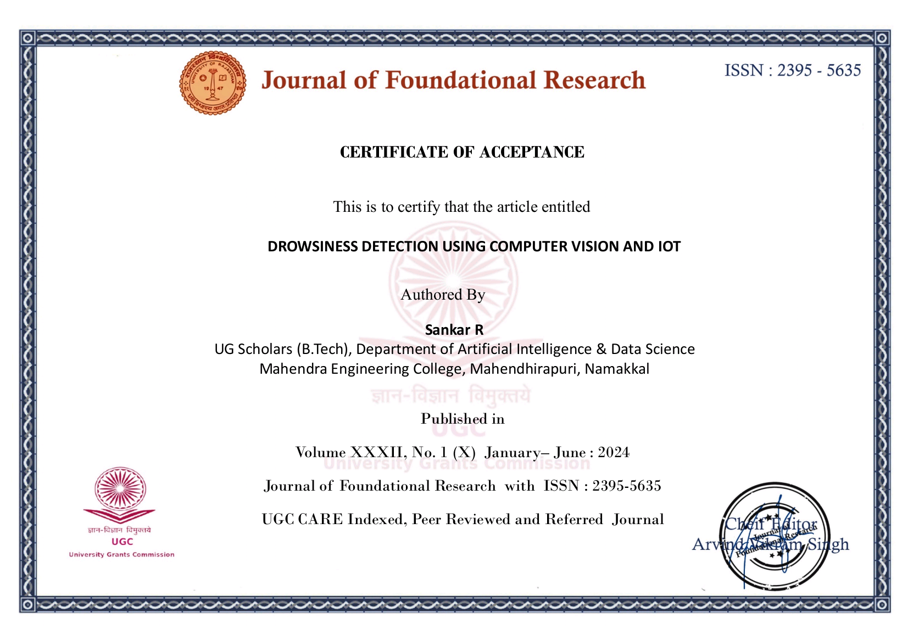

# Drowsiness Detection using Computer Vision and IoT  

This project aims to develop a drowsiness detection system using computer vision techniques. It monitors a driver's face in real-time to detect signs of drowsiness and triggers an alert if necessary, helping prevent accidents caused by fatigue.  

## Features  

- **Real-Time Drowsiness Detection**: Utilizes facial landmarks to monitor the user's eyes and face for signs of drowsiness, such as blinking patterns or yawning.  
- **Alert System**: If drowsiness is detected, an alarm is triggered (played from a sound file).  
- **Web Interface**: A simple web interface for starting and stopping the detection, as well as viewing the detection status.  

## Project Structure  

```
/DrowsinessDetectionProject
 ├── app
 │    ├── red_alert
 │    │    └── alarm.mp3         # Alarm sound for the red alert
 │    ├── drowsiness_detection.py # Core logic for drowsiness detection
 │    ├── main.py                # Main entry point for the app
 │    └── shape_predictor_68_face_landmarks # Facial landmark predictor model
 ├── frontend
 │    ├── static
 │    │    ├── css
 │    │    │    └── style.css     # Styling for the frontend
 │    │    └── js
 │    │         └── script.js     # JavaScript for frontend interactivity
 │    └── templates
 │         └── index.html         # HTML template for the main page
 └── requirements.txt            # File listing required Python libraries
```

### Frontend  

The frontend of this project is built using HTML, CSS, and JavaScript.  

- **index.html**: The main HTML page that serves as the user interface. It contains the elements for video streaming, status updates, and buttons to start/stop the drowsiness detection system.  
- **style.css**: The CSS file that defines the layout and design of the webpage. It controls the visual appearance of the buttons, status indicators, and other elements on the page.  
- **script.js**: The JavaScript file that adds interactivity to the web page. It handles tasks such as sending requests to the backend, displaying the detection status, and triggering actions like starting and stopping the detection.  

## Usage  

1. **Run the Application**:  
   Start the detection system by running the following command:  
   ```bash
   python app/main.py
   ```  

2. **Access the Web Interface**:  
   Open your web browser and go to `http://localhost:5000`. This will display the user interface where you can start and stop the detection.  

3. **Drowsiness Detection**:  
   The system will use the webcam to track the user's face and check for signs of drowsiness. If detected, an alarm sound will play.  

## Dependencies  

- Python 3.x  
- OpenCV  
- Dlib  
- Flask  
- TensorFlow or Keras (for pre-trained models)  
- Other dependencies listed in `requirements.txt`  

## Publication  

This project is also featured in the **Journal of Foundational Research**:  

- **Certificate of Acceptance**:  
  This is to certify that the article entitled:  
  **"Drowsiness Detection Using Computer Vision"**  
  Authored by **Sankar R.**, was published in the *Journal of Foundational Research*,  
  ISSN: **2395-5635**, Volume **XXXII**, No.1 (X): January–June: 2024.  



## Author  

**Sankar R**  
Email: [imsankar.rs@gmail.com](mailto:imsankar.rs@gmail.com)  
GitHub: [Sankar R](https://github.com/imSankarR)  
LinkedIn: [Sankar R](https://www.linkedin.com/in/imsankarr)  
Website: [imsankarr.com](https://imsankarr.github.io/Sankar-R-Portfolio/)  

---  
